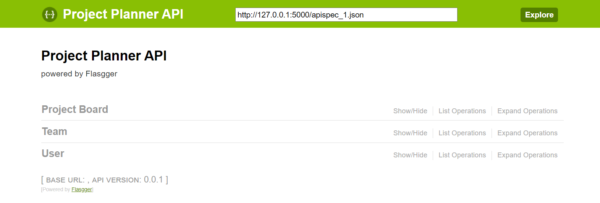
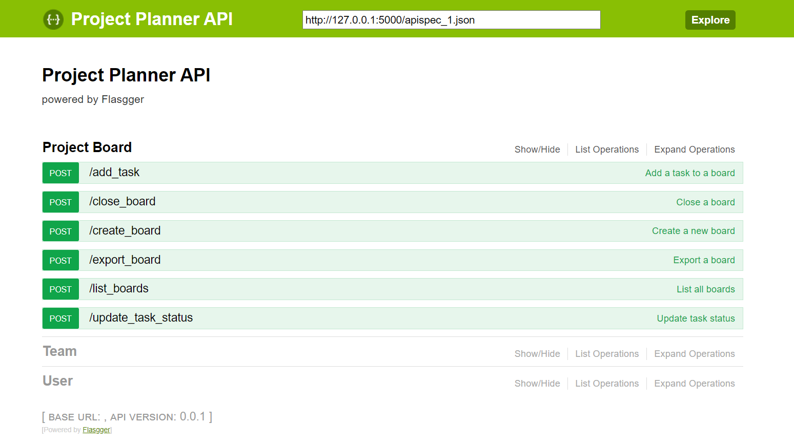
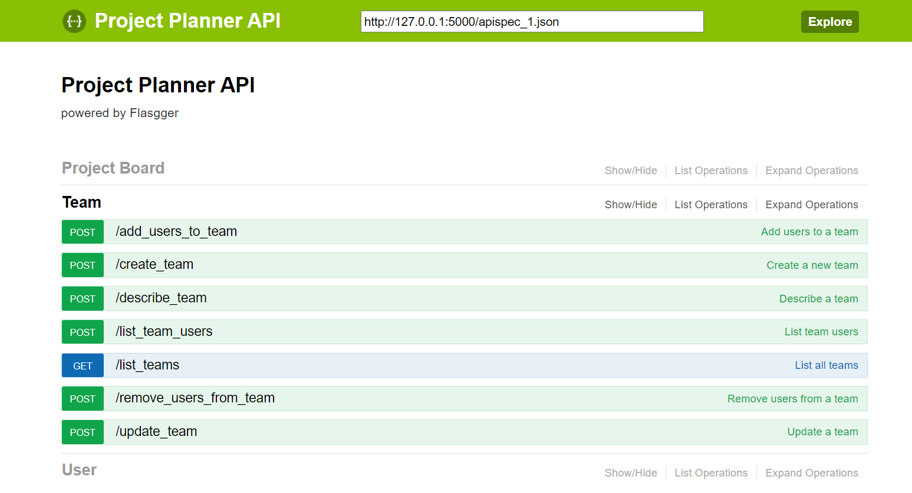
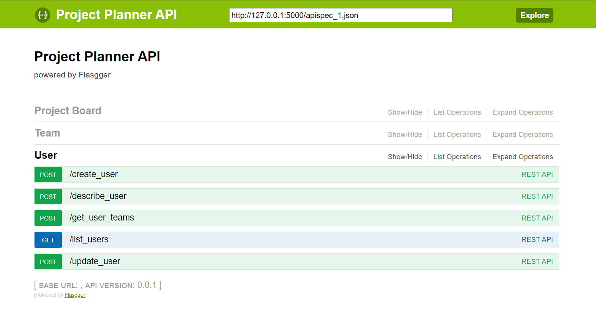
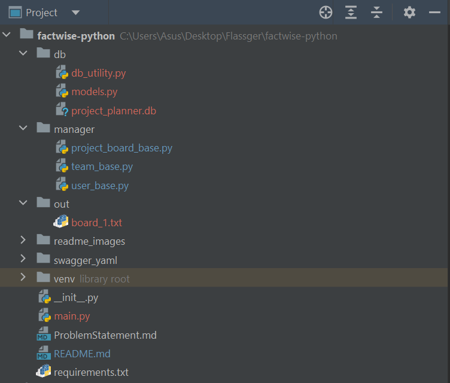

# Project Planner API

This project implements a RESTful API for managing users, teams, and project boards. It provides functionality to create, list, describe, update, and perform other operations on users, teams, and project boards.

## How to Run the Project

1. Make sure you have Python installed on your system.
2. Clone this repository to your local machine.
3. Install the required packages by running the following command: pip install -r requirements.txt
4. Run the `main.py` file to start the server. This can be done by executing the following command in your terminal: python main.py.
This will start the server on `http://127.0.0.1:5000`.
5. To access the Swagger UI for API documentation, open your browser and navigate to the following URL: `http://127.0.0.1:5000/swagger/`

## Sections

### Project Board

The Project Board section provides APIs to manage project boards. A project board represents a unit of delivery for a project and contains tasks assigned to users. The APIs in this section allow you to:

- Create a new board with the provided details.
- Add tasks to a board.
- Update the status of a task.
- Close a board once all tasks are complete.
- List all boards for a team.
- Export a board to a TXT file.

### Team

The Team section provides APIs to manage teams. A team represents a group of users working together on a project. The APIs in this section allow you to:

- Create a new team with the provided details.
- List all teams.
- Describe a team and retrieve its details.
- Update team details such as name and description.
- Add users to a team.
- Remove users from a team.
- List the users of a team.

### User

The User section provides APIs to manage users. Users are individuals who are part of the project planning tool. The APIs in this section allow you to:

- Create a new user with the provided details.
- List all users.
- Describe a user and retrieve their details.
- Update user details such as display name.
- Get the teams associated with a user.

## Project Directory Structure

The project directory structure is organized as follows:

1. `db`: Contains database utility files and database files, including the database model class file.
2. `out`: Contains exported project board TXT files.
3. `manager`: Contains the main logic files for the three functionality APIs: `user_base.py`, `team_base.py`, and `project_board_base.py`.
4. `swagger_yaml`: Contains the YAML files for API documentation.
5. `main.py`: Contains the main logic for running the application and setting up the API endpoints.
6. `requirements.txt`: Lists the required packages for the project.

## Technology Stack

This project utilizes the following technologies:

- Python: A powerful and versatile programming language used for developing the API logic.
- Flask: A lightweight web framework for building APIs in Python.
- SQLAlchemy: An Object-Relational Mapping (ORM) library for working with databases.
- Flasgger (Swagger UI): A tool for documenting and testing APIs using Swagger UI.

Python was chosen as the programming language for its simplicity and wide adoption in web development. Flask provides a flexible and easy-to-use framework for building RESTful APIs. SQLAlchemy serves as the ORM to interact with the SQLite database and perform database operations. Flasgger (Swagger UI) is used for API documentation, providing an interactive and user-friendly interface to explore and test the APIs.

Feel free to explore the code and APIs to manage your project's users, teams, and project boards!
